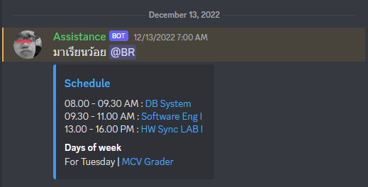
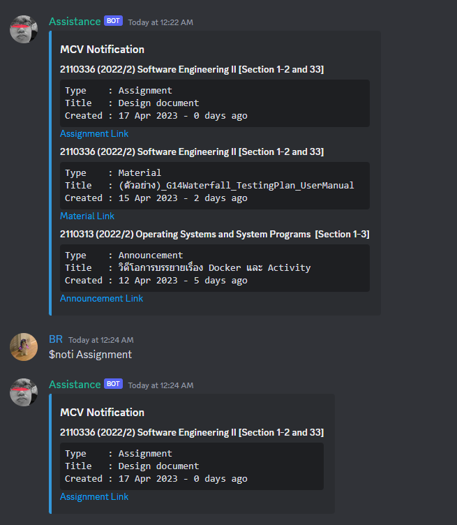

# Discord-Bot

useful command

- Send schedule every 7 a.m.

</a>

- Help command  
**usage**: $help

</a>

- Plot graph  
**usage**: $plot [number]

</a>

- QR-code  
**usage**: $qrcode <[list of things] or [link]>

</a>

- Job Finder  
**usage**: $job [keyword_skill] [unwanted_skill]

</a>

- Poll  
**usage**: $poll [title] [choice1 choice2 ...]

</a>

- Notification  
**usage**: $noti [days] [type]

</a>